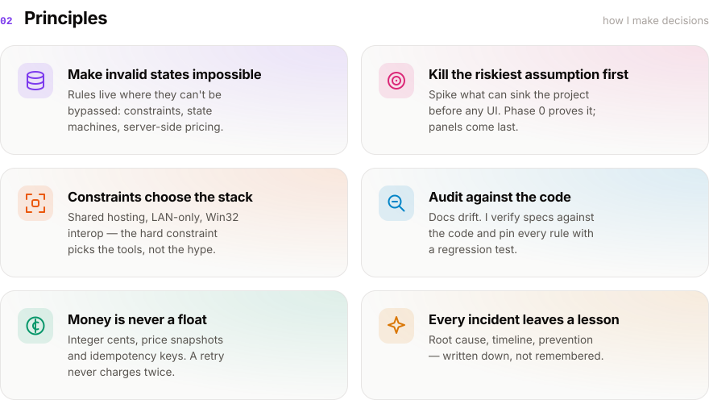
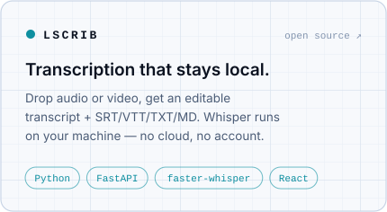
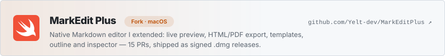
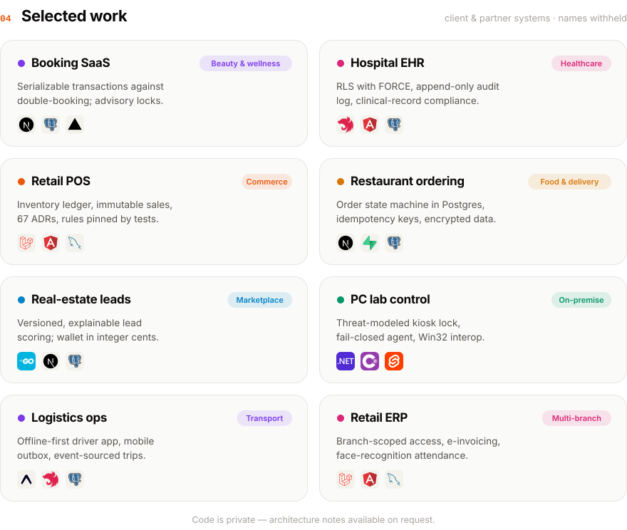
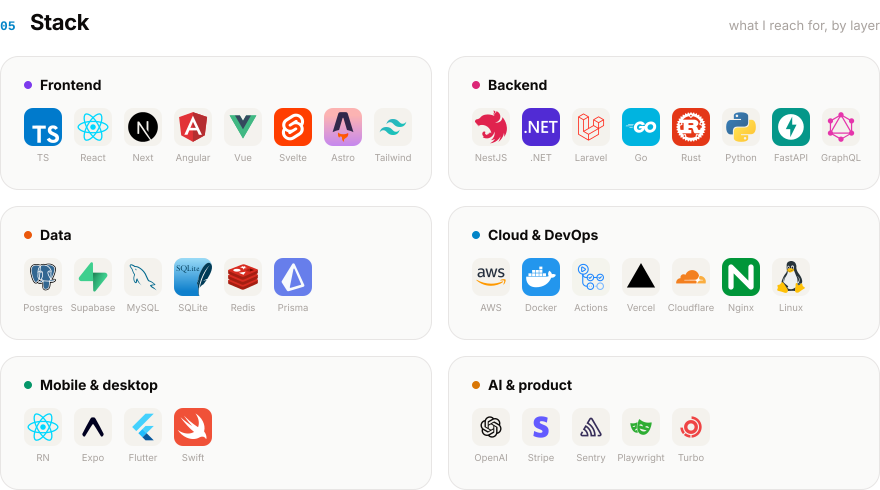

<!-- Profile designed as an architecture drawing set. Assets in ./assets (light + dark), regenerated with generate-assets.py. -->

<picture><source media="(prefers-color-scheme: dark)" srcset="./assets/hero-dark.svg"></picture>

 

<picture><source media="(prefers-color-scheme: dark)" srcset="./assets/principles-dark.svg"></picture>

 

<picture><source media="(prefers-color-scheme: dark)" srcset="./assets/oss-dark.svg"></picture>

<a href="https://github.com/Yelt-dev/dueo"><picture><source media="(prefers-color-scheme: dark)" srcset="./assets/dueo-dark.svg"></picture></a>
<a href="https://github.com/Yelt-dev/lscrib"><picture><source media="(prefers-color-scheme: dark)" srcset="./assets/lscrib-dark.svg"></picture></a>

<a href="https://github.com/Yelt-dev/MarkEditPlus"><picture><source media="(prefers-color-scheme: dark)" srcset="./assets/markedit-dark.svg"></picture></a>

  

<picture><source media="(prefers-color-scheme: dark)" srcset="./assets/work-dark.svg"></picture>

 

<picture><source media="(prefers-color-scheme: dark)" srcset="./assets/stack-dark.svg"></picture>

 

<picture><source media="(prefers-color-scheme: dark)" srcset="./assets/contact-dark.svg"></picture>

<a href="https://linkedin.com/in/yeltsinlopezv"><picture><source media="(prefers-color-scheme: dark)" srcset="./assets/btn-linkedin-dark.svg"></picture></a>
<a href="mailto:yeltsin.lopez94@gmail.com"><picture><source media="(prefers-color-scheme: dark)" srcset="./assets/btn-email-dark.svg"></picture></a>

  

<picture>
  <source media="(prefers-color-scheme: dark)" srcset="https://streak-stats.demolab.com?user=Yelt-dev&hide_border=true&background=0B1220&stroke=24385A&ring=00C2D1&fire=00C2D1&currStreakNum=E6EDF7&currStreakLabel=00C2D1&sideNums=E6EDF7&sideLabels=8A9BB5&dates=5B6E8C">
  
</picture>

